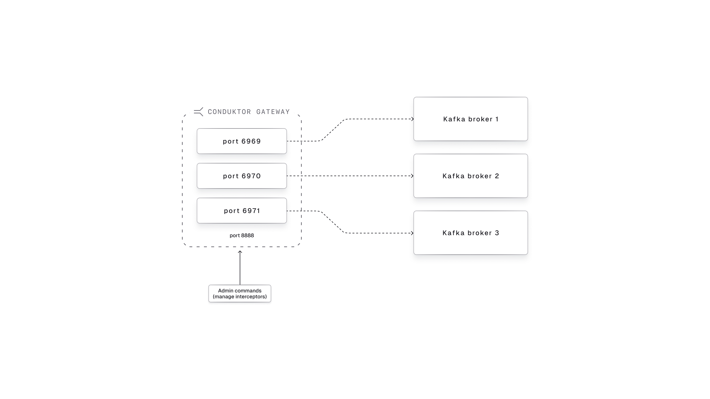

# Deploy Conduktor Gateway with Kubernetes and Host-based Routing

## Video Walkthrough

Here is a full walkthrough tutorial.

[](https://youtu.be/u4tMiWcxRvo).

Note that the video uses wildcard SANs. This repository has since been updated not to use wildcard SANs in order to reflect security best practices.

## Introduction and Concepts

Conduktor Gateway is a Kafka protocol proxy with an extensive catalog of [interceptor plugins](https://docs.conduktor.io/gateway/category/interceptor-catalog/) to centrally enforce policies like 
- schema payload validation
- business rule validation
- field-level encryption and field-level decryption
- client configuration overrides
- many more!

The default way Conduktor Gateway routes traffic to Kafka brokers is with port-based routing.
Each Gateway instance opens a port for each broker.

<div style="text-align: center;">
  
</div>

However, this can cause complications when the number of brokers changes.
Gateway is happy to automatically expose more ports, but firewalls and load balancer targets would require reconfiguration.
This is especially problematic when using a managed Kafka service where the number of brokers can change without warning.

One way to solve this is with host-based routing, also known as Server Name Indication (SNI) routing.
SNI routing allows Gateway expose a single port and route requests to individual brokers based on hostname rather than port ([see SNI routing guide in the docs](https://docs.conduktor.io/gateway/how-to/sni-routing/) for more information).

This tutorial sets up SNI routing specifically for a Kubernetes cluster that exposes Gateway to clients externally via an Ingress.
Kubernetes has its own networking concepts, so it is helpful to see an example for how SNI routing works for Conduktor Gateway deployed on Kubernetes specifically.

Here is an overview of what we will deploy:

<div style="text-align: center;">
  
</div>


## Setup

To run this all locally, I will use [OrbStack](https://orbstack.dev/), a container and VM management tool for Mac only (sorry!).
I chose OrbStack specifically because this tutorial aims to show how external clients will connect via an Ingress Controller, which can otherwise be difficult to do without either running up a cloud bill or sacrificing authenticity compared to a real-world deployment.
OrbStack has some networking magic that makes the entire tutorial run locally without sacrificing authenticity.

1. Install homebrew at [https://brew.sh/](https://brew.sh/).
1. Install `helm` and `orbstack` and a few other things.
    ```
    brew install \
        helm \
        orbstack \
        openssl \
        openjdk \
        kafka \
        conduktor/brew/conduktor-cli
    ```
    [Helm](https://helm.sh/) is a package manager for Kubernetes.

    [Orbstack](https://orbstack.dev/) is a management system for containers and Linux VMs that makes it convenient to run Kubernetes locally, among other things.

    Openjdk is a Java runtime. This is required to use the `keytool` command to generate keystores and truststore for certificates, as well as Kafka CLI tools. You may need to add it to your `PATH` in your shell profile for the shell to properly locate and execute the program. For example, add the following line to your `~/.zshrc` profile:
    ```bash
    export PATH="/opt/homebrew/opt/openjdk/bin:$PATH"
    ```

## Prepare Certificates

This example will generate certificates that will be used by Kafka brokers and Gateway instances to establish secure connections using TLS.

This example will use TLS (formerly known as SSL) to encrypt data in transit between:
- between Kafka clients and Conduktor Gateway
- between Conduktor Gateway and Kafka

1. Run the following script to generate the keystores and truststore.

    ```bash
    ./generate-tls.sh
    ```

1. Inspect the certificates for various services. For example, inspect the gateway certificate.
    ```bash
    openssl x509 \
    -in ./certs/gateway.conduktor.k8s.orb.local.fullchain.crt \
    -text -noout
    ```
    ```
    Certificate:
        Data:
            ...
            Issuer: CN=ca1.test.conduktor.io, OU=TEST, O=CONDUKTOR, L=LONDON, C=UK
            ...
            Subject:
                C=UK, L=LONDON, O=CONDUKTOR, OU=TEST,
                CN=gateway.conduktor.k8s.orb.local
            ...
            X509v3 extensions:
                ...
                X509v3 Subject Alternative Name:
                    DNS:gateway.conduktor.k8s.orb.local, 
                    DNS:brokermain0-gateway.conduktor.k8s.orb.local,
                    DNS:brokermain1-gateway.conduktor.k8s.orb.local,
                    DNS:brokermain2-gateway.conduktor.k8s.orb.local
    ```
    **IMPORTANT:** Notice the **Subject Alternate Names** (SAN) that allow Gateway to present various hostnames to the client. This is crucial for hostname-based routing, also known as Server Name Indication (SNI) routing. Kafka clients need to know which particular broker or brokers they need to send requests to.

    OrbStack handles DNS resolution automatically for us in this example, but in general, DNS must resolve all of these names to the Ingress load balancer IP address. In this case, you would need a DNS record for `gateway.conduktor.k8s.orb.local` and CNAME aliases for each SAN all pointing to the load balancer IP.
    
    Gateway impersonates brokers by presenting various hostnames to the client -- for example, `brokermain0-gateway.conduktor.k8s.orb.local` to present to the client as the broker with id `0`. The client first needs to trust that the certificate presented by Gateway includes that hostname as a SAN, otherwise TLS handshake will fail. The client then makes its request to `brokermain0-gateway.conduktor.k8s.orb.local`. Gateway receives this request and uses the SNI headers to understand that it needs to forward the request to the Kafka broker with id `0`.

    We recommend using a certificate with a wildcard SAN, which in this case would be `*.conduktor.k8s.orb.local`, as well as the matching DNS wilcard CNAME alias. The `*` wildcard allows for brokers to be added or removed without any changes to certificates, DNS, port security rules, or load balancer targets. If broker `4` is added, requests to that broker will be routed just like for broker `0` without needing to update any infrastructure configuration.
    
    If your certificate issuer or security team doesn't support wildcard SANs, then you can overprovision these SANs and DNS CNAME aliases, for example with brokermain0 through brokermain200.
    

1. (Optional) Inspect the `generate-tls.sh` script to see how it
    - Creates a certificate authority (CA)
    - Creates a CA cert
    - Uses the CA cert to create service certificates for Kafka and Conduktor Gateway
    - Constructs Subject Alternate Names (SANs) to allow Gateway to present to clients as any broker.
    - Creates a truststore that clients can use to validate the identity of any service's certificate that has been signed by the CA


## Deploy

Deploy Kafka and Gateway.

```bash
./start.sh
```

A lot happens here:
- Create shared namespace `conduktor`
- Create kubernetes secrets for Kafka
- Create kubernetes secrets for Gateway
- Install Kafka via Bitnami's Kafka helm chart
- Install Gateway via Conduktor's helm chart
- Install `ingress-nginx` Ingress Controller
- Create Ingress for Gateway

Inspect the start script, helm values, and ingress definition.

Deploy Console (Optional).

```bash
./start-console.sh
```

What it does:
- Create kubernetes secret for PostgreSQL
- Create kubernetes secret for Console
- Install PostgreSQL via Bitnami's PostgreSQL helm chart
- Install Console (with Cortex included) via Conduktor's helm chart
- Configure Console to connect to Kafka and Gateway

Note 1: After this, you can access Console on https://console.conduktor.k8s.orb.local and login as administrator with username `admin@demo.dev` and password `adminP4ss!`.
You have to ignore the warning from the browser about insecurity of the site because this Console is actually configured on HTTP port 8080 inside the pod. 
But OrbStack exposes it as HTTPS. So the certificate name does not match the domain name. We will need to revisit this in the future. (TODO!!)

Note 2: Conduktor Gateway has been configured with "Gateway" flavour. But it cannot communicate with the gateway because it does not have the correct truststore.
So, to make it work, you have to check "Skip SSL Check" in the "Provider" tab. DO NOT upload the truststore because it will break the connections to the clusters
(see [CUS-562](https://linear.app/conduktor/issue/CUS-562/internal-uploading-certificate-via-ui-breaks-kafka-cluster-connections)).

## Connect to Gateway

Connect to the adminREST API call, which should receive a successful response with an empty list.
```bash
curl \
    --request GET \
    --url 'https://gateway.conduktor.k8s.orb.local:8888/gateway/v2/interceptor?global=false' \
    --user "admin:conduktor" \
    --cacert ./certs/rootCA.crt
```
```
[
]%
```

In newer JDKs, Java clients need to run with this env var set (see [KIP 1006](https://cwiki.apache.org/confluence/display/KAFKA/KIP-1006%3A+Remove+SecurityManager+Support)):
```bash
export KAFKA_OPTS="-Djava.security.manager=allow"
```
You can also add ` -Djavax.net.debug=ssl` to enable ssl debug messages.

Look at the hostnames in the metadata returned by Kafka.

```bash
kafka-broker-api-versions \
    --bootstrap-server franz-kafka.conduktor.svc.cluster.local:9092 \
    --command-config client.properties | grep 9092
```

**NOTE**: The above uses a bit of OrbStack magic to reach an internal service from your laptop.
Usually you would only be able to reach an internal service from a pod within the kubernetes cluster.

Look at the hostnames in the metadata returned by Gateway, accessed externally.

```bash
kafka-broker-api-versions \
    --bootstrap-server gateway.conduktor.k8s.orb.local:9092 \
    --command-config client.properties | grep 9092
```

**NOTE**: OrbStack allows you to reach external services using the `*.k8s.orb.local` domain via Ingress Controller.

Create a topic (going through Gateway).

```bash
kafka-topics --bootstrap-server gateway.conduktor.k8s.orb.local:9092 \
    --create --topic test --partitions 6 \
    --command-config client.properties
```

List topics (directly from Kafka).

```bash
kafka-topics --list \
  --bootstrap-server franz-kafka.conduktor.svc.cluster.local:9092 \
  --command-config client.properties
```

List topics (going through Gateway).

```bash
kafka-topics --list \
  --bootstrap-server gateway.conduktor.k8s.orb.local:9092 \
  --command-config client.properties
```

Produce to the topic (going through Gateway).

```bash
echo "hello" | kafka-console-producer --topic test \
  --bootstrap-server gateway.conduktor.k8s.orb.local:9092 \
  --producer.config client.properties
```

Consume from the topic (going through Gateway). Press `Ctrl+C` to quit.

```bash
kafka-console-consumer --topic test --from-beginning \
  --bootstrap-server gateway.conduktor.k8s.orb.local:9092 \
  --consumer.config client.properties
```

## Cleanup

Clean up kubernetes resources.

```bash
kubectl delete namespace conduktor
```

If you also want to delete the Ingress controller, 

```bash
./stop.sh
```

## Takeaways

- Your Ingress Controller must support **layer 4 routing** (TCP, not HTTP) with **TLS-passthrough**.
    - For AWS EKS this would mean using the Load Balancer Controller with Network Load Balancer (NLB).
    - TLS passthrough is required so that Gateway can use the SNI headers in the TLS handshake to route requests to specific brokers. 
- Your client must be able to resolve all hosts advertised by Gateway to the external load balancer. In this example, OrbStack magically points all `*.k8s.orb.local` to the ingress-nginx Ingress Controller, and the Ingress we defined points these hosts to the `gateway-external` service:
    - `gateway.conduktor.k8s.orb.local`
    - `brokermain0-gateway.conduktor.k8s.orb.local`
    - `brokermain1-gateway.conduktor.k8s.orb.local`
    - `brokermain2-gateway.conduktor.k8s.orb.local`
    - As brokers are added, any `brokermain<broker id>-gateway.conduktor.k8s.orb.local` will be routed automatically without requiring changes elsewhere in the infrastructure.
- Gateway's TLS certificate must include SANs so that it can be trusted by the client when it presents itself as different brokers. 
  - Alternatively, you could use a certificate with a wildcard CN, which in this case would be `CN=*.conduktor.k8s.orb.local`
- Since we are using an external load balancer, we do not need to use Gateway's internal load balancing mechanism. The external load balancer will distribute load.
- Console creates its own Ingress, so we do not need to add anything to ingress for Console.

## Appendix

### kcat commands

The interaction between kcat and OrbStack's ingress controller is a bit buggy. Connections often drop.

```bash
kcat -L -b franz-kafka.conduktor.svc.cluster.local:9092 \
    -X security.protocol=SASL_SSL -X sasl.mechanism=PLAIN \
    -X sasl.password=admin-secret -X sasl.username=admin \
    -X ssl.ca.location=./certs/snakeoil-ca-1.crt
```

```bash
kcat -L -b gateway.conduktor.k8s.orb.local:9092 \
    -X security.protocol=SASL_SSL -X sasl.mechanism=PLAIN \
    -X sasl.password=admin-secret -X sasl.username=admin \
    -X ssl.ca.location=./certs/snakeoil-ca-1.crt
```

```bash
echo "hello1" | kcat -t test -P -b gateway.conduktor.k8s.orb.local:9092 \
    -X security.protocol=SASL_SSL -X sasl.mechanism=PLAIN \
    -X sasl.password=admin-secret -X sasl.username=admin \
    -X ssl.ca.location=./certs/snakeoil-ca-1.crt
```

```bash
kcat -t test -C -b gateway.conduktor.k8s.orb.local:9092 \
    -X security.protocol=SASL_SSL -X sasl.mechanism=PLAIN \
    -X sasl.password=admin-secret -X sasl.username=admin \
    -X ssl.ca.location=./certs/snakeoil-ca-1.crt
```
